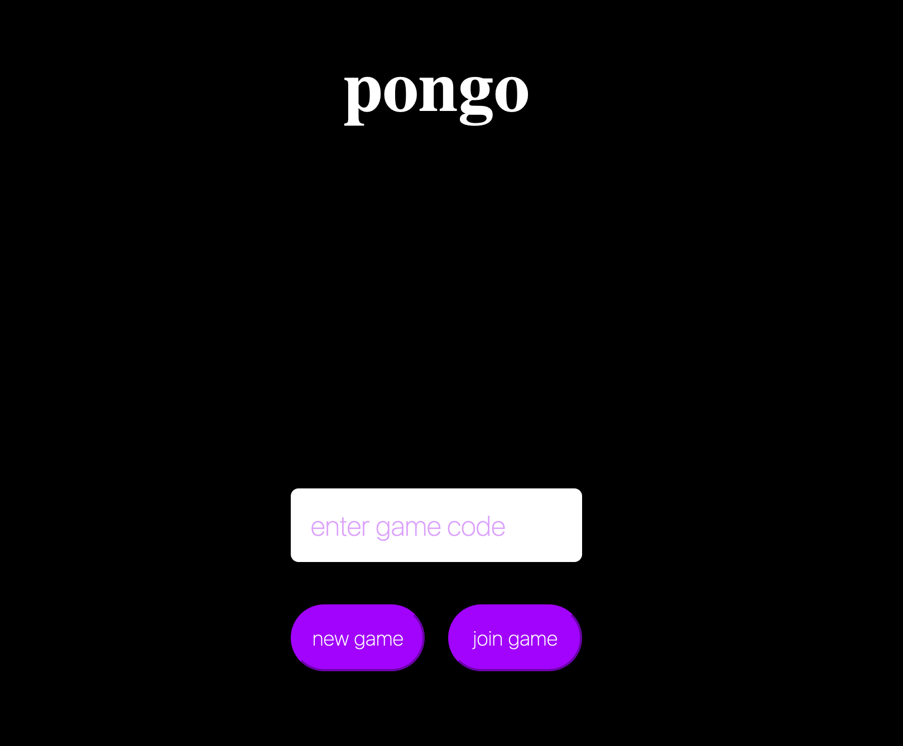

# Pongo
##### A simple multiplayer Pong game written with Go and HTML5 Canvas.

### Getting Starting
1) Go to https://pongo.michaelwomack.dev
2) Enter a ~unique (it's not that serious) game code to create a new game or join an existing game: 
3) If creating a new game, share the game code with your opponent.
4) Battle!
